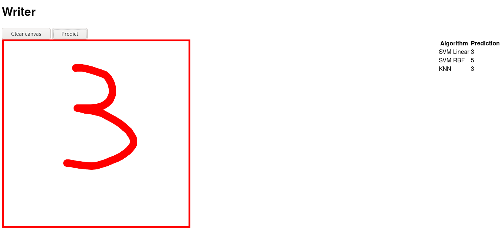

# (ML) Writer

An experiment to show how to develop a real-world ML app. Recognizes hand-written digits using MNIST dataset.



## Running

To run the web service, use the following commands:

```
poetry install
poetry shell
uvicorn main:app
```

## Build models

To build models, use Jupyter Notebook and save the models in the `trainer` folder, in `.joblib` format